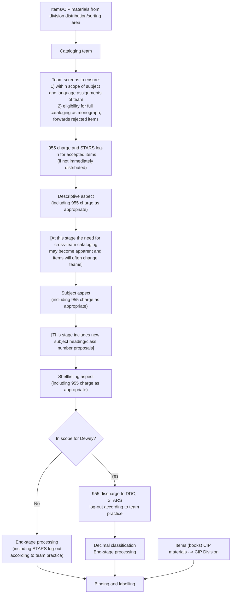
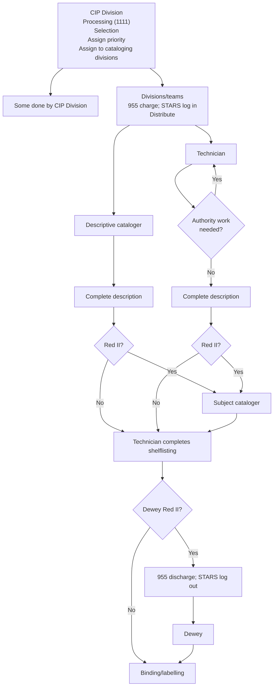

Minimal level cataloging is normally a one-step, one-person operation done by 1) descriptive
catalogers and minimal level catalogers on cataloging teams and 2) by staff in the Enhanced
Cataloging Division when a record is not available to do copy cataloging (lccopycat). There are
three aspects different from previous practice:

1. because of requirements relating to ACQUIRE, more in-process records are done by
acquisitions staff, and therefore more items designated for MLC are represented by
in-process records than was previously the case;
2. items in scope for MLC include both those slipped as priority 4 (now designated for
MLC in the new system) and items that have been in an uncataloged state prior to the
current three years, i.e., any item received at LC earlier than the current three years;
3. each division doing MLC is now responsible for determining how the division's MLC
labels are printed and for consultation with the person/entity responsible for allocating
blocks of numbers to ensure that duplication does not occur.

**Chart 1: New Full Cataloging--Monographs (Initial Bibliographic Control**
**Workflow)**
Acquisitions Divisions CIP Division
(purchases; exchanges; gifts) (CIP materials; PCN; U.S. Copyright
deposits)
*Acquisition stage*
*Item-in-hand stage*
IBC processing in the Acquisitions Directorate and the CIP Division includes the
following activities as appropriate
Searching
Selecting
Create/update in-process record
Slip item
Assign priority
Assign to cataloging divisions
Forward to cataloging divisions
**Chart 2: New Full Cataloging--Monographs (Cataloging Workflow)**

**Chart 3: CIP Verification/Upgrade Workflow**

